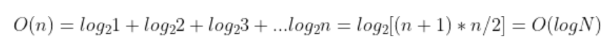

# Problem
The problem description gives several very detailed examples.  

# Approach
A linear search can solve this problem easily,  we just need to find out the which range for the query score it is. 
E.g.  rank table is

| score | rank |
|-------|------|
| 100   | 1    |
| 100   | 1    |
| 50    | 2    |
| 40    | 3    |
| 40    | 3    |
| 20    | 4    |
| 10    | 5    |

input=5  we can find it will be located the behind of the last score 10.  So output = 6
for input =10,  output=5
input = 25,  because  25 >20 and 25 < 40,  output= 4. 

Since the score table is decreasing order. We can use many way to accelerate the search. Also we can compass the score 
table to  

| score | rank |
|-------|------|
| 100   | 1    |
| 50    | 2    |
| 40    | 3    |
| 20    | 4    |
| 10    | 5    |

In C++,  search tree will be a good candidate to score table. Also, because we need to find the low boundary of input.
E.g. for 25,  we need to find 20,  for 41 we need to find 40. https://cplusplus.com/reference/map/map/lower_bound/ is
perfect 


# Complexity 
## construct search tree 
```cpp
   for(int i =1; i< scores_count; ++i){
        int score;
        cin >>score;
        if(score != current_score){
            current_rank++;
            score_to_rank.insert({score, current_rank});
            current_score = score;
        }

    }
```

## query search tree


So overall time complexity is logN.