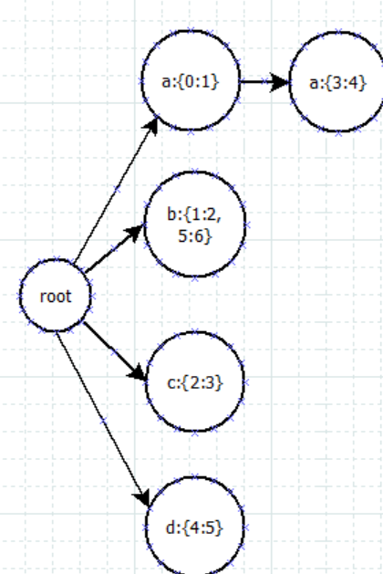

# Problem
The question can be simplified as, 
1. give a dictionary of words and values.
2. give string, match as many as possible words in dictionary

# Approach
An index tree is a good start to store dictionary. E.g. 

For target string "caaab". 
1. check "caaab".  Only can match c.
2. check "aaab", Because 0 is excluded by [1,5], so only can match a-a
3. check "aab",  same as above
4. check "ab",  no match, because "a" is excluded.
5. check "b",  can match 1:2, and 5:6 both. 

# Complexity
Construct dictionary needs n*s

Query needs O(n^2) 
