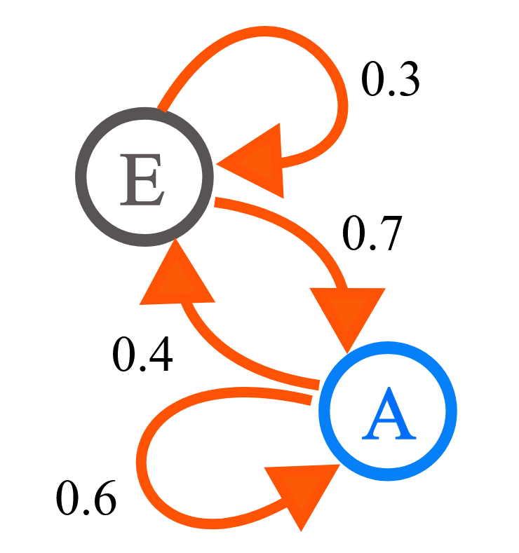
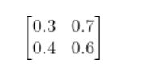
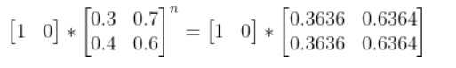
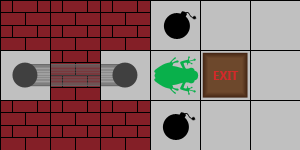

# Problem 
This is a very interesting question. Unlike the normal maze question, the frog jumps randomly with unify probability.
We need to get the probability of frog can jump out maze. 

We can't use dfs in this case, we have to use Markov chain to calculate the probability of frog in final state, which
means frog is in the place of Exit. The correct criteria also mentioned, **your answer will be considered to be 
correct if its (absolute) difference from the true answer is not greater than 10E-6.**

## recall Markov Chain
https://en.wikipedia.org/wiki/Markov_chain  a classic example is 


State E has 0.3 probability to stay, and 0.7 probability to transfer to A.

State A has 0.6 probability to stay, and 0.4 probability to transfer to E. 

So we have transition matrix



for give init state,  from E=1, A=0



when n-> infinite, the final state will convergence  (0.3636,  0.6364)

## state of maze
I will use the simpler example to demonstrate how to present maze to a state vector



This maze has 3*6, we can use a 1*18 vector to present init state 
[0, 0, 0, 0, 0, 0, 0,
0, 0, 0, 0, 1, 0 , 0,
0, 0, 0, 0, 0, 0, 0]

Frog has 4 cells can jump,  so every cell has 0.25 probability.

Jump_up= [0, 0, 0, 0, 0.25, 0, 0,
0.25, 0, 0, 0, 0, 0.25 , 0,
0, 0, 0, 0.25, 0, 0, 0]

Please note, the left jump will slide to  cell (1, 0),  instead of staying in (1,3). Let's construct the transition matrix

## transition matrix
Basically,  element[x][y]  is the probability, frog jump from x to y.  

For cell (0, 0),  because it is obstacle, so it is all 0.

For cell (0, 3),  it is a mine,  same, frog can't jump from here to any other cell. 

For cell (1, 3),  it has 4 other possible cells. For cell(1, 5), it has only 3 possible jumps so every cell get 0.333, 
and so on so forth. 

The final matrix is
```
,0        ,0        ,0        ,0        ,0        ,0        ,0        ,0        ,0        ,0        ,0        ,0        ,0        ,0        ,0        ,0        ,0        ,0

,0        ,0        ,0        ,0        ,0        ,0        ,0        ,0        ,0        ,0        ,0        ,0        ,0        ,0        ,0        ,0        ,0        ,0

,0        ,0        ,0        ,0        ,0        ,0        ,0        ,0        ,0        ,0        ,0        ,0        ,0        ,0        ,0        ,0        ,0        ,0

,0        ,0        ,0        ,0        ,0        ,0        ,0        ,0        ,0        ,0        ,0        ,0        ,0        ,0        ,0        ,0        ,0        ,0

,0        ,0        ,0   ,0.3333        ,0   ,0.3333        ,0        ,0        ,0        ,0   ,0.3330        ,0        ,0        ,0        ,0        ,0        ,0        ,0

,0        ,0        ,0        ,0   ,0.5000        ,0        ,0        ,0        ,0        ,0        ,0   ,0.5000        ,0        ,0        ,0        ,0        ,0        ,0

,0        ,0        ,0        ,0        ,0        ,0        ,0        ,0        ,0        ,0        ,0        ,0        ,0        ,0        ,0        ,0        ,0        ,0

,0        ,0        ,0        ,0        ,0        ,0        ,0        ,0        ,0        ,0        ,0        ,0        ,0        ,0        ,0        ,0        ,0        ,0

,0        ,0        ,0        ,0        ,0        ,0        ,0        ,0        ,0   1.0000        ,0        ,0        ,0        ,0        ,0        ,0        ,0        ,0

,0        ,0        ,0   ,0.2500        ,0        ,0   ,0.2500        ,0        ,0        ,0   ,0.2500        ,0        ,0        ,0        ,0   ,0.2500        ,0        ,0

,0        ,0        ,0        ,0   ,0.2500        ,0        ,0        ,0        ,0   ,0.2500        ,0   ,0.2500        ,0        ,0        ,0        ,0   ,0.2500        ,0

,0        ,0        ,0        ,0        ,0   ,0.3333        ,0        ,0        ,0        ,0   ,0.3333        ,0        ,0        ,0        ,0        ,0        ,0   ,0.3333

,0        ,0        ,0        ,0        ,0        ,0        ,0        ,0        ,0        ,0        ,0        ,0        ,0        ,0        ,0        ,0        ,0        ,0

,0        ,0        ,0        ,0        ,0        ,0        ,0        ,0        ,0        ,0        ,0        ,0        ,0        ,0        ,0        ,0        ,0        ,0

,0        ,0        ,0        ,0        ,0        ,0        ,0        ,0        ,0        ,0        ,0        ,0        ,0        ,0        ,0        ,0        ,0        ,0

,0        ,0        ,0        ,0        ,0        ,0        ,0        ,0        ,0        ,0        ,0        ,0        ,0        ,0        ,0        ,0        ,0        ,0

,0        ,0        ,0        ,0        ,0        ,0        ,0        ,0        ,0        ,0   ,0.3333        ,0        ,0        ,0        ,0   ,0.3333        ,0   ,0.3333

,0        ,0        ,0        ,0        ,0        ,0        ,0        ,0        ,0        ,0        ,0   ,0.5000        ,0        ,0        ,0        ,0   ,0.5000        ,0
```

# Approach 
We need to convert the init maze to a state vector (n*m),  also we need to create the transition matrix automatically.
Follow the rule, 
1. Mine can't move to any, 
2. obstacle also can't move to any. 
3. Exit can't move to any.  
4. space cell needs to count home many cells can be move in with 4 possible moves. 

Then we continue use [init state vector] * matrix * matrix.  Then we check if the probability of Exit cell is convergence, 
abs(previous result - current result) < 10E-6. 

# Complexity
Construct matrix need O(n*m). However the convergence speed is not controlable.

## sparse matrix multiple
For any row of matrix, max number of element which is not zero is 4. It means,  comparing to n*m,  most of elements are 0.
we can only store element not zero with hashmap, and only multiple element not zero to accelerate the matrix multiple. 
Actually, if you don't do this optimization, you can't pass every test cases. 


