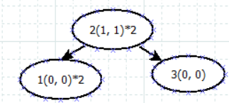

# Problem
The question is pretty straightforward, how many element moved during insert sorting. 

## recall insert sort 
https://en.wikipedia.org/wiki/Insertion_sort. The basic ideal is, 
1. there are two areas,  sorted area followed by unsorted area. 
2. Every time,  pick the first element in unsorted area.
3. find the correct position we need to insert. 
4. move every element back 1 position
5. insert the picked element into correct place. 


## straightforward solution
Just do a insert sort, and count how many element we moved. However, insert sort has O(n^2), it will timeout for some 
test cases. 

# Approach
Instead of keeping a linear sorted area,  we can use a search tree,  then when a element is inserted into sorted area, the 
time complexity can be reduced to log(n). Also,  we can track how many element are greater then the insertion point. 

E.g.  2 1 3 1 2,  init, tree only has one node 2, and left number and right number are both 0. 


After 1 is inserted,  2's left number count +1,  because 2's right_count = 0,  so only 2 needs to be moved,  result =1 


After 3 is inserted, because 3 is inserted into the right child of root, no need move, result = 1


Then the second 1 is inserted, 2 needs to be moved, also because 2's right_count is 1,  result = 1 + 1 + 1 =3


Then the second 2 is inserted,  because 2's right_count is 1,  result = 3 + 1  =4




## 1 simple search tree implementation.
The code looks like this 
```cpp
#include <cmath>
#include <cstdio>
#include <vector>
#include <iostream>
#include <algorithm>
#include <map>
#include <fstream>
using namespace std;

struct Node{
    int leftNumber ;
    int rightNumber;
    Node* pLeft;
    Node* pRight;
    int value;
    int count;
    Node(int v = 0){
        leftNumber =0;
        rightNumber =0;
        pLeft = nullptr;
        pRight = nullptr;
        value = v;
        count = 1;
    }
    ~Node(){
        delete pLeft;
        delete pRight;
    }
};
int insert_to_search_tree(Node* root, int num){
    int result = 0;
    if(root==nullptr){
       return 0;
    }
    Node* p = root;
    while(true) {
        if (p->value == num) {
            p->count++;
            result += p->rightNumber;
            break;
        } else if( num < p->value) {
            result += p->rightNumber+p->count;
            p->leftNumber ++;
            if(p->pLeft!=nullptr){
                p = p->pLeft;
            }
            else{
                p->pLeft = new Node(num);
                break;
            }
        }
        else if( num > p->value) {
            p->rightNumber ++;
            if(p->pRight!=nullptr){
                p = p->pRight;
            }
            else{
                p->pRight = new Node(num);
                result += (p->rightNumber-1);
                break;
            }
        }
    }

    return result;
}

int main() {
    int T;
    cin>>T;

    for(int i =0; i<T; ++i){
        int N;
        cin>>N;
        Node * root = new Node();
        cin>>root->value;
        root->count = 1;
        long long result = 0;
        for(int j=1; j< N; ++j){
            int num;
            cin>>num;
            result += insert_to_search_tree(root, num);
        }
        cout<<result<<endl;
        delete root;
    }
}

```
This code can pass all test cases,  except TestCase 7 timeout.  Two reasons:
1. Balancing tree code is not added.  When the array is sorted, the search tree degenerates to a linked list. 
2. Language tricky. For cpp, we need release tree manually. In destructor of Node,  we call nodes' children destructor recursively. It causes lots of time to release every node. 

I will use binary b+ tree + memory pool to resolve two issues above.


## Binary B+ Tree 
### recall B+ Tree
https://en.wikipedia.org/wiki/B-tree  Basically,  B+ tree has index in nodes,  and all elements are stored in leaves node. 

### Binary B+ Tree
In this problem, we know integer in array is in range 0 - 10E8,  it is less than  2^24. So we can use a B+ tree which has 
every bit as index of layers to quickly insert the integer. 


So if we have a integer, we can finally find a leaf node in the tree,  with fixed compare count (24),  like a kind of
Radix sort. 

Also we can track right_count and left_count in index node.

To resolve the node release issue,  we can pre allocate a vector of nodes, then release thw whole vector at the end. The
full code is in solution.cpp. 

# Complexity
For each insertion,  we need to do 24 compare, O(n*24) = O(n);

For space,  finally, we will have n leaf nodes. Based on binary tree's attribute, the index nodes should be less than 
leaf nodes,  so space is also O(n).


